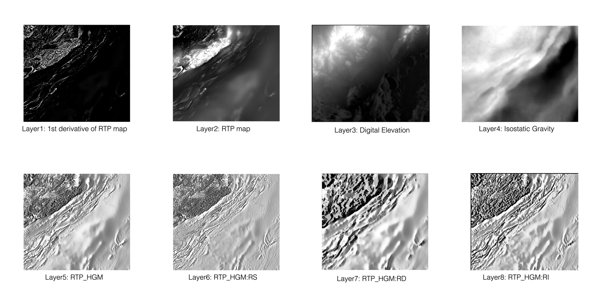
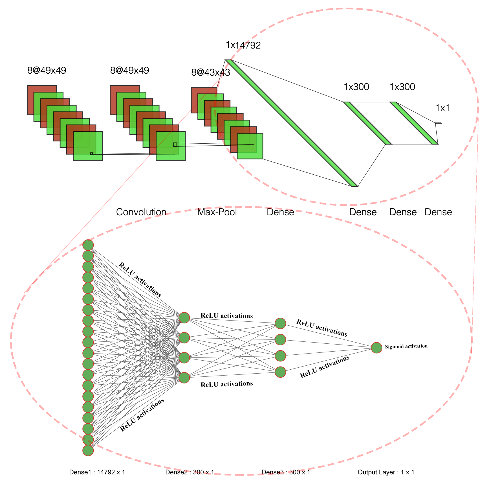
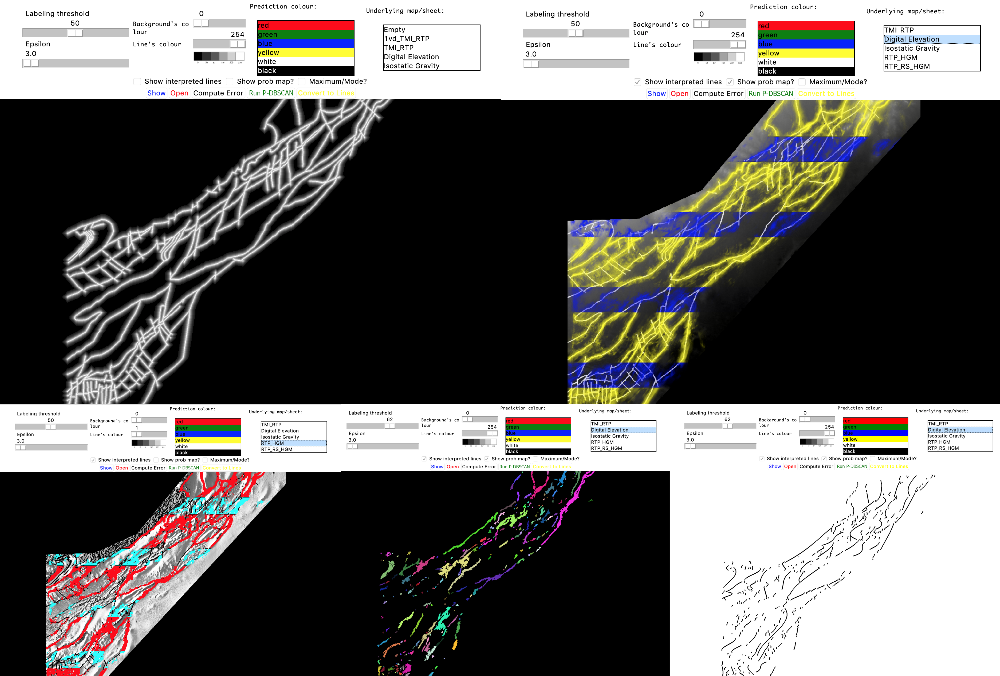

# LineamentLearning

Minerals exploration is becoming more difficult, particularly because most mineral deposits at the surface of the earth have been found. While there may be a lot of sensing data, there is a shortage of expertise to interpret that data. This thesis aims to bring some of the recent advances in AI to the interpretation of sensing data. Our AI model learns one-dimensional features (lineaments) from two-dimensional data (in particular, magnetics surveys, maps of gravity and digital elevation maps), which surprisingly has not had a great deal of attention (whereas getting two-dimensional or zero-dimensional features is very common). We define a convolutional neural network to predict the probability that a lineament passes through each location on the map. Then, using these probabilities, cluster analysis, and regression models, we develop a post-processing method to predict lineaments. We train and evaluate our model on large real-world datasets in BC and Australia.

This repository contains all codes used in my [Master Thesis](http://hdl.handle.net/2429/68438). This program developed under Python3 and using Numpy, Keras, Tensorflow, Pillow, TKinter, Matplot, Scipy libraries. 

## Input Layers
We use 8 aerial images to train this model: 

## Model
We designed and trained the following model using Keras and Tensorflow libraries. It starts from the input layer on the left which is consist of patches of size W × W × 8. Then we have a convolution 21 layer that creates a 3 × 3 convolution kernel that is convolved with the layer input to produce the output. A rectified linear unit (ReLU) is applied to the outputs of the convolutions. In order to reduce the dimensionality and to allow generalization in patches, we use 6 × 6 max pooling operations, which combine the outputs of neuron clusters at one layer into a single neuron in the next layer. We use a flatten layer that reshapes and merges previous hidden layers in the network into a single one-dimensional array. Finally, we use a fully connected neural network with two hidden layers with ReLU activations and one output layer of size one with Sigmoid activation.

## Author
* [**Amin Aghaee**](https://github.com/aminrd/) 

You can find more details in my thesis [here](http://hdl.handle.net/2429/68438).
